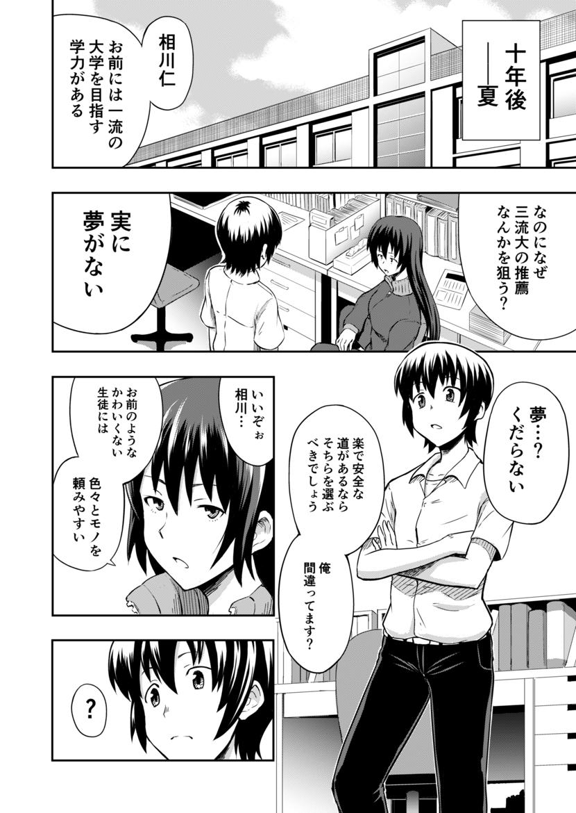
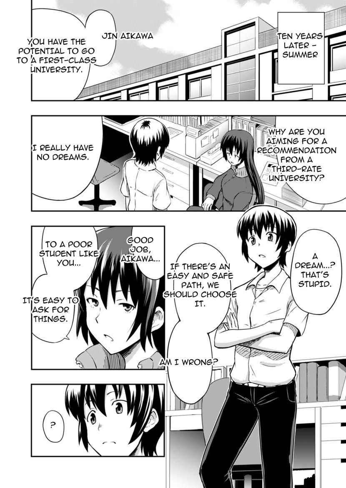
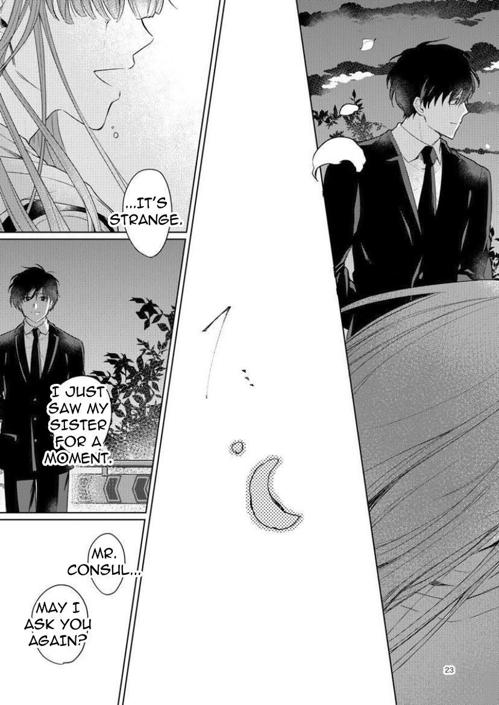
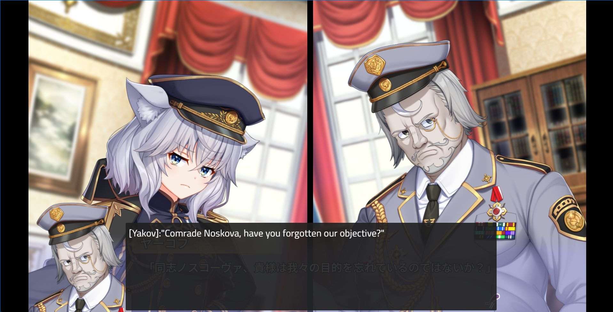
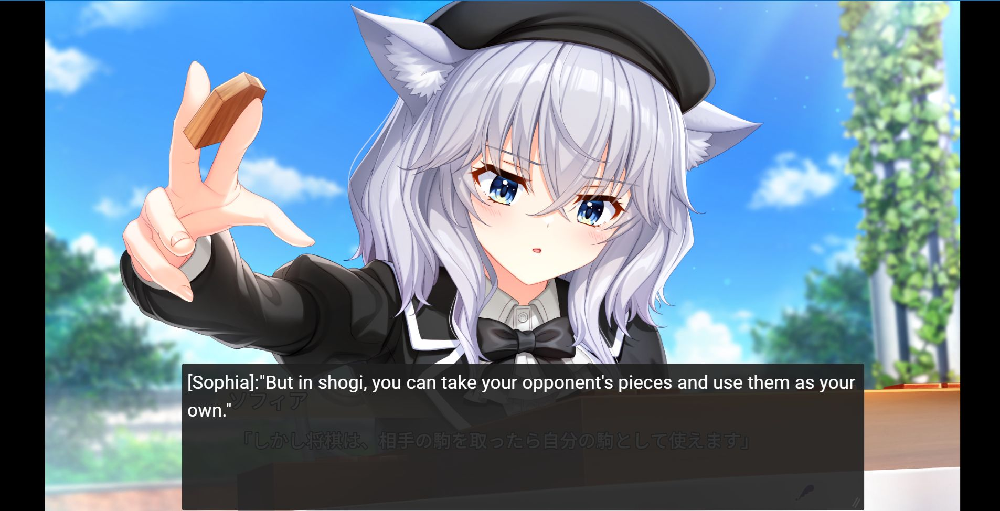
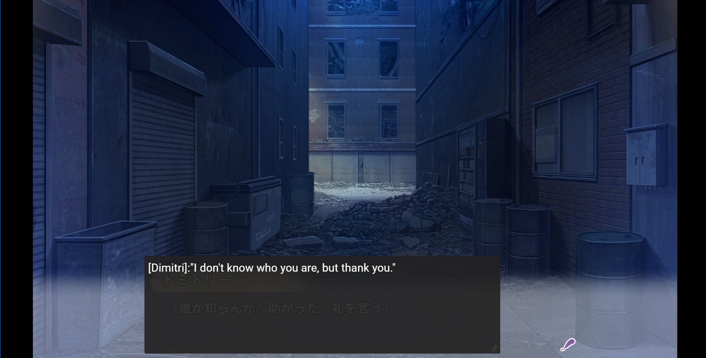
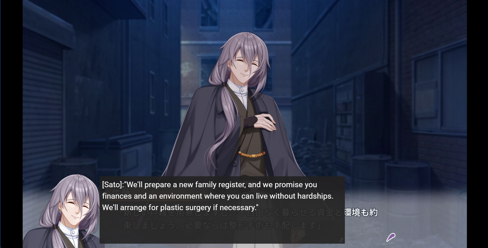

# Mango 2

Mango 2 allows you to machine translate Japanese manga images to English. It can also be used for games if you have Textractor setup, or some other tool that can copy game text to the clipboard. All the translation models support using previous sentences as additional contextual info.

**All the AI models are installed locally** - no need to worry about rate limits!

Mango 1 is deprecated - bigger models and bigger systems are the way to go.

These models are still in the process of tuning - results not final.

# Examples

### Images

<table width="50%">
  <thead>
    <tr>
      <th width="50%">Source</th>
      <th width="50%">Translation</th>
    </tr>
  </thead>
  <tbody>
    <tr>
      <td width="50%"></td>
      <td width="50%"></td>
    </tr>
    <tr>
      <td width="50%"></td>
      <td width="50%"></td>
    </tr>
    <tr>
      <td width="50%"></td>
      <td width="50%"></td>
    </tr>
  </tbody>
</table>

### Games

    
    
    
    
    (No way we can trust this guy, right?)

# Installation

1. [Download MangoBase.ZIP.](https://drive.google.com/file/d/1JQ2L5WAU8c54LQRUZm7EZMt9uDMrC37o/view?usp=sharing)
2. Unzip the file.
3. Open "mango.exe"

# Requirements

- Windows 11 (some users report it working with older Windows versions... not 100% sure on this)
- 10GB disk space
- 8GB RAM

A Nvidia GPU should **NOT** be required for CPU usage. In fact, the translation model was optimized for CPU usage. A Nvidia GPU is only required if you want even faster translations (4GB VRAM if accelerating Detection and OCR models only, ~16GB VRAM for accelerating everything).

# Guides

[Using Mango 2 to translate images or manga pages](guides/mtl_images.md)

[Using Mango 2 with Textractor to translate games](guides/mtl_games.md)

# Model packs

Mango 2 comes preinstalled with a basic model pack. All of the model packs here are optional, but may enhance the experience.

Unzipping a model pack will reveal a `models` folder. Drag this `models` folder to where `mango.exe` is located.

- Additional text box and line models [coming soon]
- Japanese-2-English Qualia v5.4 [on hold - busy experimenting with Radical]
- Japanese-2-English Radical v1.2 [coming way later...? Results unsatisfactory so far]
- Japanese-2-English Madness v1.0 [maybe coming in the future]
- Japanese Lite OCR v0.5 + Japanese Massive OCR v1.0 [coming very soon]
- Escalator v0.1 [coming probably never. Very hard to tune this one to a satisfactory level]
- Reranking models v0.9 [coming soon]
- Pronoun post editing models v0.2 [coming soon]
- Inpainting edge model v0.1 [coming soon, but of poor quality]
- Paintball v1.0 [coming soon... maybe? It's still speculative]
- Korean-2-English OCR + Qualia models [coming soon]
- Chinese-2-English OCR + Qualia models [coming soon]

# Where are the benchmarks?

There's a few issues we need to address first.

**Issue 1:** What metrics do we use? Professional human evaluations are expensive. You and me are (probably) not made out of money, so that leaves us with automated metrics: BLEU is a lame metric. chrF++ is a bit better but still pretty poor. That leaves us with deep metrics like COMET, BERTScore, etc... (COMET seems good enough).

Unfortunately from personal experiments, COMET (and other deep metrics) wasn't highly sensitive to minor pronoun changes - like changing "He said I should go eat broccoli in peace." to "She said I should go eat broccoli in peace." - This is unfortunate since (in my opinion) zero pronoun resolution is one of the biggest issues in MTLing CJK to English. COMET also has issues with extremely long sentences on occasion. COMET also doesn't seem to be super sensitive to typos in named entities which is a bummer (this translation model needs a lot of work regarding named entity translation). All that said, COMET is still way better than BLEU.

**Issue 2:** Fairness. What are we really gauging with these benchmarks? Whether one model is better than the other? But can we really say that model A is better than model B - even if it scores higher on a benchmark? How do we know that model A wasn't trained on data in the benchmark? Large encoder-decoder MT models tend to be extremely effective at domain adaptation after all. It's also extremely easy to "beat" a benchmark when it comes to unconstrained MT - just train on more data (or make the model bigger)! More data and more scale is king.

**Issue 3:** I love data. I love seeing my models adapt to another domain. I love seeing model loss curves go down by 0.0004 and consistently stay at a lower level. If there was a benchmark containing "test data" unseen by the model, I would love to just take the data and train the model on it further, which would ultimately make the benchmark pointless anyways.

In internal benchmarks (just for sanity testing) a previous variant of this translation model "outperformed" some other candidates in COMET score. But again I stress that those benchmarks don't give us the full picture and are likely not fair at all. The only thing we can take away from the internal tests is that all the models probably perform competitively with each other, and aren't subject to fatal errors, such as repeating one token ad-infinitum (not to be confused with general mistranslations). Also remember issue 3? Well, after the internal sanity tests were done, I trained the model further with that data. So it's totally pointless to test on now.

# Wait, where did you get the data to train these models?

:innocent:

# Special thanks

NLLB - Their baseline model was used to train the MT models.

MangaOCR - They have an awesome script to synthesize data.

COMET - Their training scripts were used to help train one of the reranking models used here. They're also very responsive at answering issues. Super helpful!

OPUS - While the OPUS dataset was not used to train these models, it was used for experimentation, and was probably used to pretrain the NLLB models. Some of the logic they used to clean their data was also reused here.

Ultralytics - Their pretrained YOLO models are nice... but if you want to actually get serious about training YOLO maybe consider YOLOv5 libraries. Ultralytics seems better for quicker deployment instead.

Adam Mini - Pretty neat optimizer. Only used it for minor experiments so far but there may be something of interest here. Often fails to compete with Adafactor unfortunately.

OpenMantra Dataset - Used for showing some examples.

Too many MT research papers / projects to name (Adafactor, DocRepair, knn-MT, BERTFill, 2+2-Concat, B2T, Quality-aware decoding, P-transformer, RoPE, etc...) - Almost all of these tricks ended up failing horrifically but they were a great learning experience nonetheless. (For example: Never use relative positional embeddings alone on tiny MT models for "hard" language pairs)

[Some observations and discoveries in my journey](guides/quibbles.md)