# Mango 4

Mango 4 is an all-batteries-included tool to machine translate Japanese media such as games and manga to English in real-time.

**All these models are installed locally** - no need to worry about rate limits! My models are also amoral... if you know you know.

Features include:

### Local AI optimized for speed for cheap (no need for killer hardware!)

<video src="https://github.com/user-attachments/assets/b7462028-5500-4496-ad0d-0decda1b3a7a" width="500" controls muted></video>

### Stores translations in case they need to be translated again even faster (such as for user interfaces in games.)

<video src="https://github.com/user-attachments/assets/d6800d99-9920-4b0b-b799-bc8a22128e23" width="500" controls muted></video>

### Supports Chinese/Korean OCR'ing and translation to English with my other models (installed separately.)

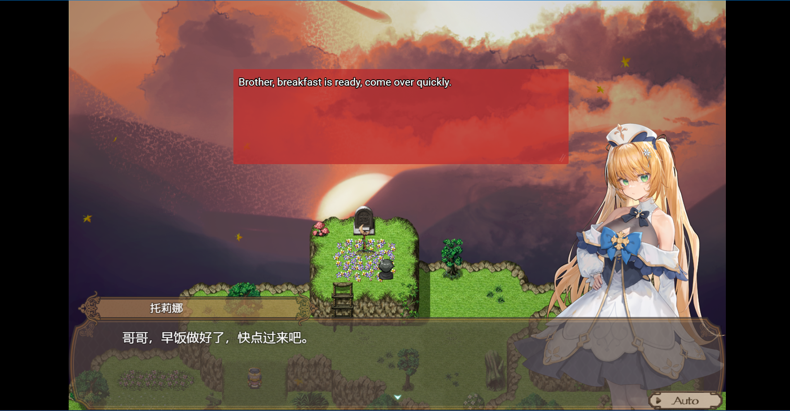

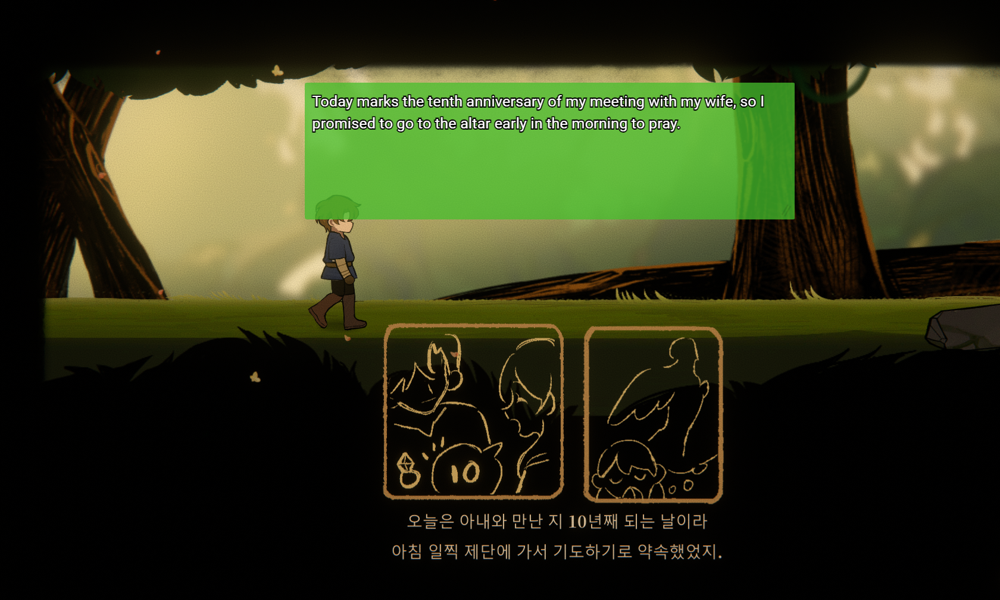

### Stores past texts as context for future texts to translate (potentially better pronoun resolution.)

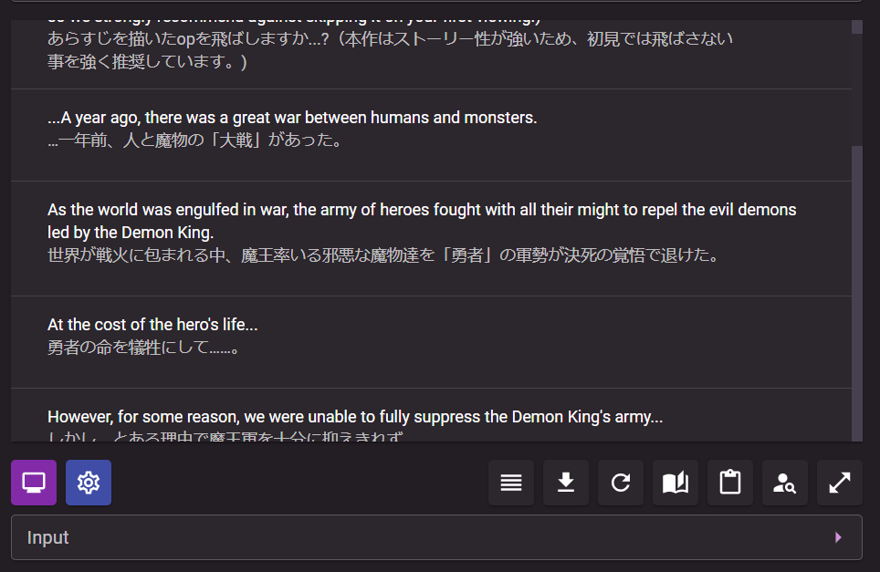

### Supports translating certain character names with your own dictionary (dictionary-aware!)

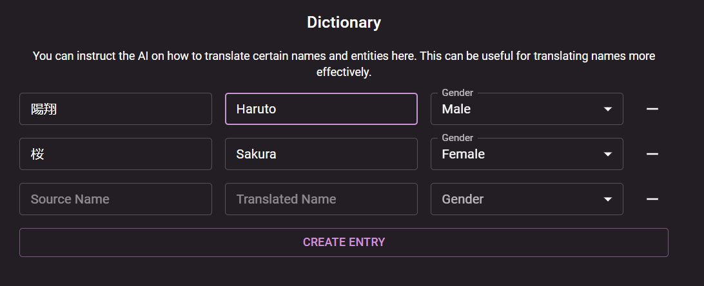

### Supports custom GGUF translation models, and they can be configured to use RAG with your own data - retrieving similar translations to use as examples (in-context learning!)

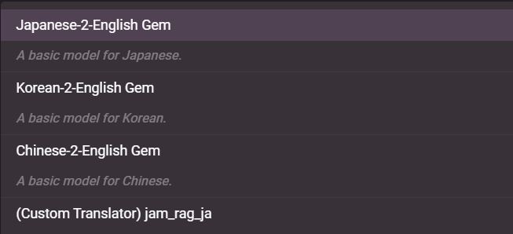

### Supports multiple open OCR windows (for games where text can appear in multiple locations.)

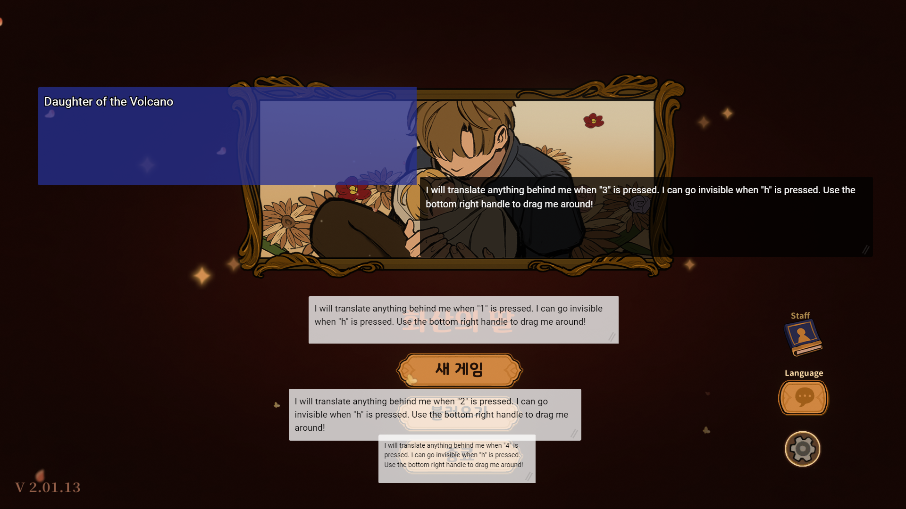

Most of these features can be enabled/disabled in the settings menu.

# Other examples

### Translating manga

<table width="10%">
  <thead>
    <tr>
      <th width="50%">Source</th>
      <th width="50%">Translation</th>
    </tr>
  </thead>
  <tbody>
    <tr>
      <td width="50%">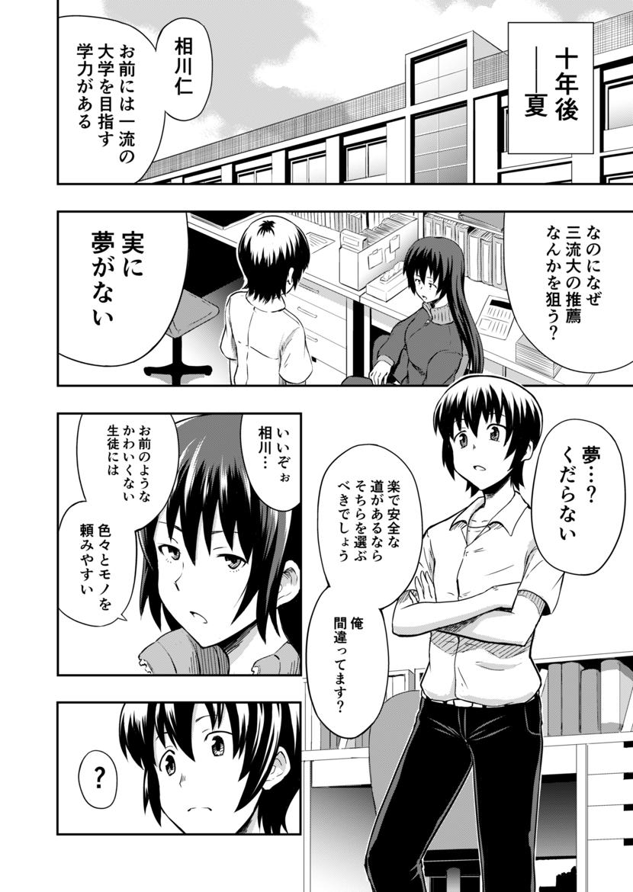</td>
      <td width="50%">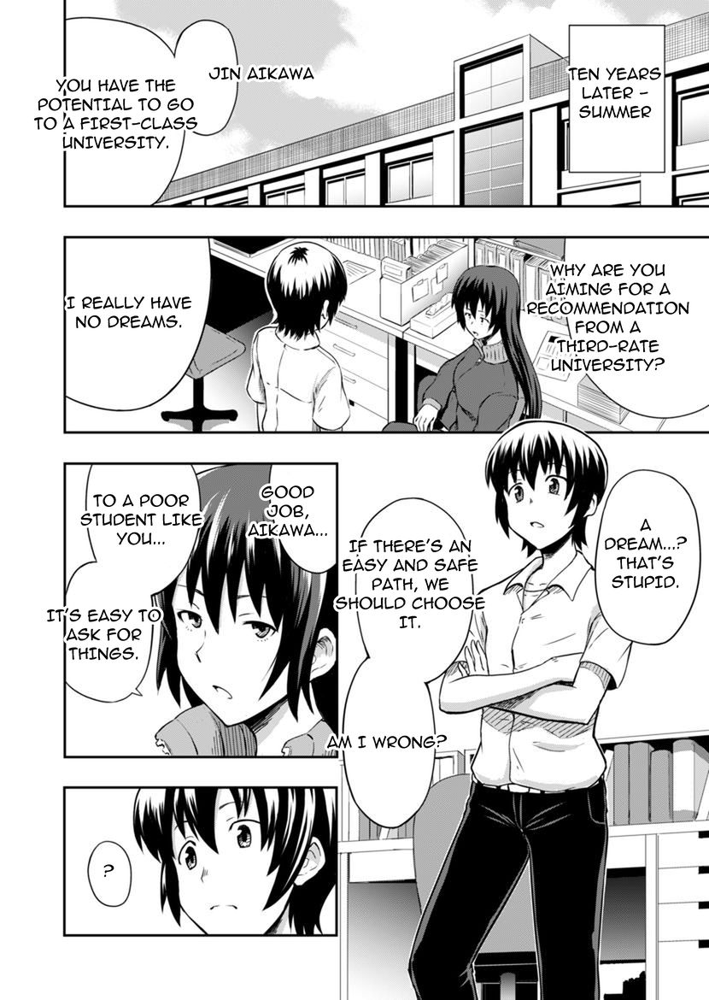</td>
    </tr>
    <tr>
      <td width="50%"></td>
      <td width="50%"></td>
    </tr>
    <tr>
      <td width="50%"></td>
      <td width="50%">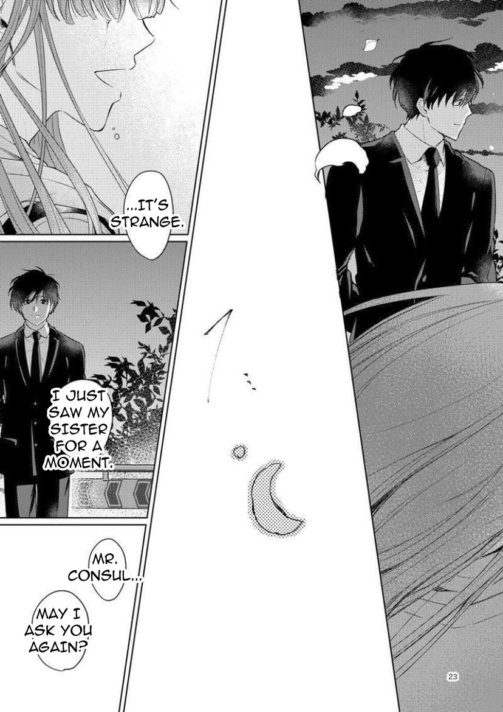</td>
    </tr>
  </tbody>
</table>

### Translating games in real-time

    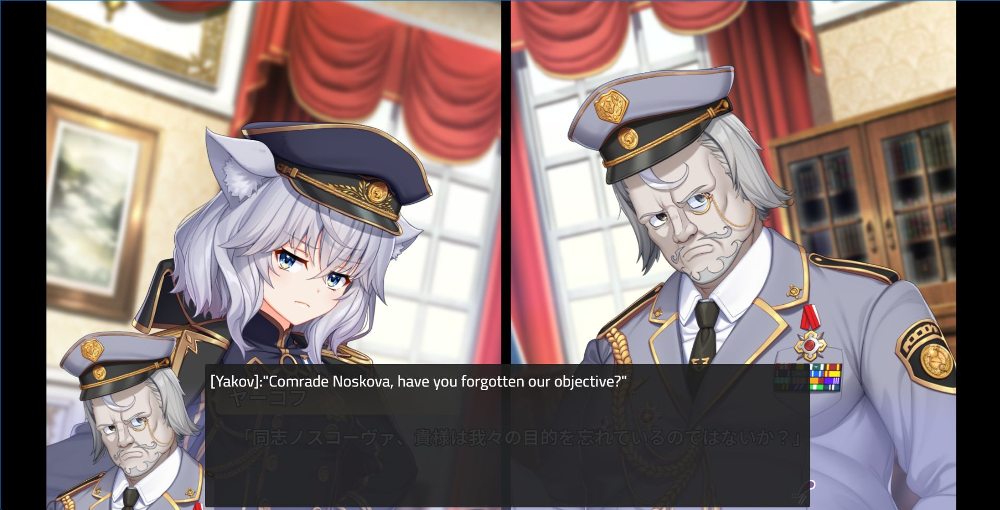
    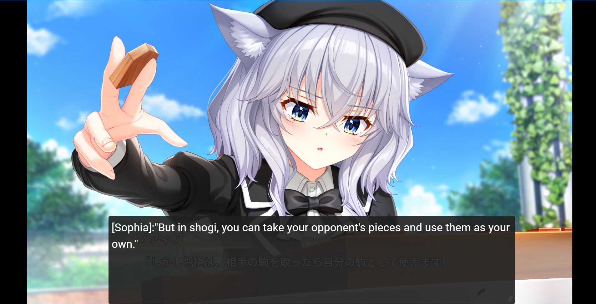
    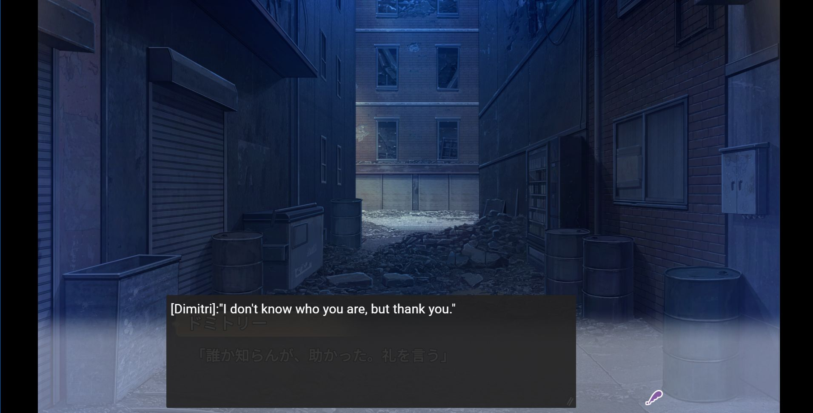
    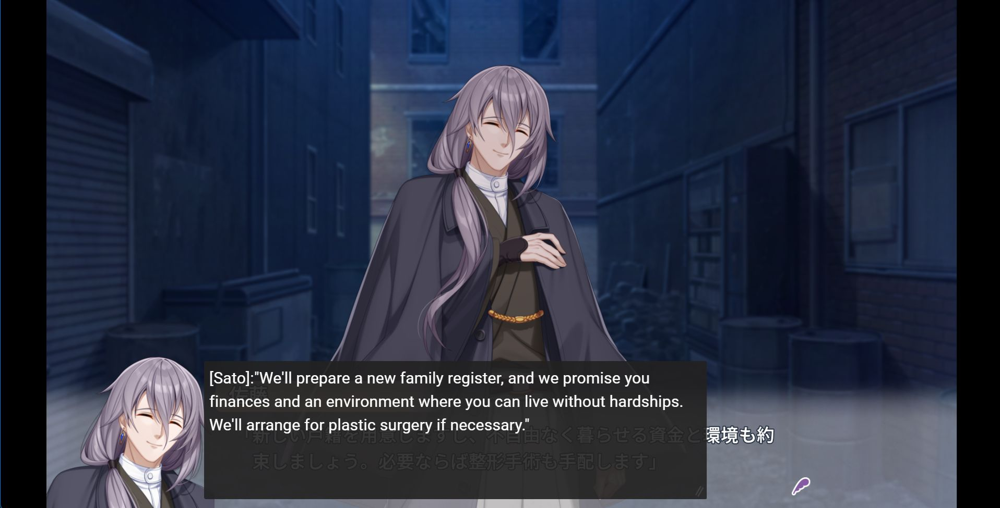
    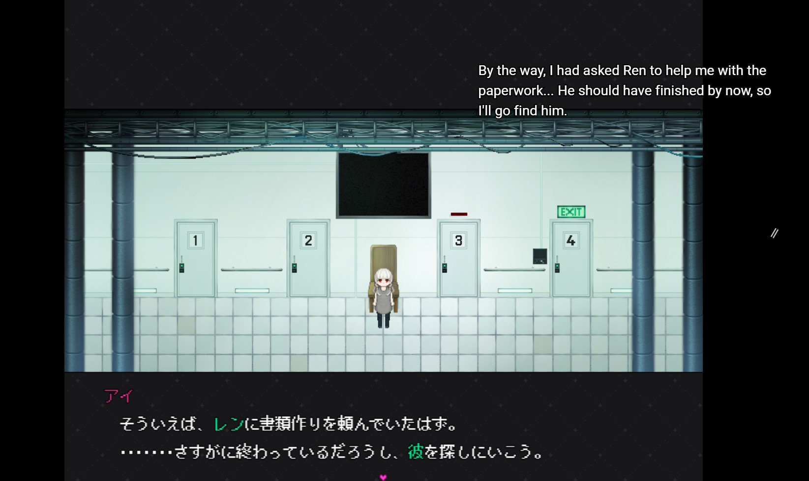
    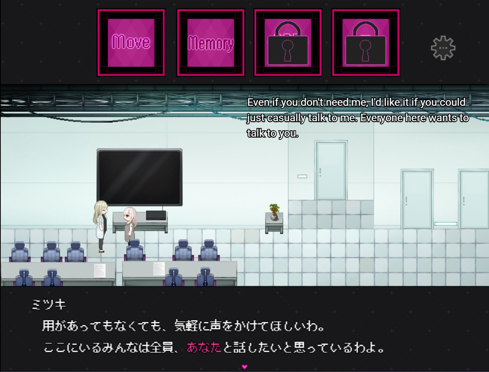

# Installation

1. [Download Mango](https://drive.google.com/file/d/1Uf-uCVCutjljhC4EnnyTt3JiDm5RmhKl/view?usp=sharing)
2. Unzip the file.
3. Open "mango.exe" - it will take a minute to load.

# Requirements

- Windows 10 (some users report it working with older Windows versions... not 100% sure on this)
- 12 GB disk space
- 8 GB RAM
- Visual Studio 2015, 2017, 2019, and 2022 C++ Redistributables (install from [here](https://aka.ms/vs/17/release/vc_redist.x64.exe) or [here](https://learn.microsoft.com/en-us/cpp/windows/latest-supported-vc-redist?view=msvc-170))

A Nvidia GPU should **NOT** be required for CPU usage. A Nvidia GPU is only required if you want even faster translations, in which case:

- 4 to 6 GB VRAM (for base models)
- 16 GB VRAM (for stronger translation models)

# Guides

[Using Mango 4 to translate images or manga pages](guides/mtl_images.md)

[Using Mango 4 without Textractor to translate games](guides/mtl_games_ocr.md)

[Using Mango 4 with Textractor to translate games](guides/mtl_games.md)

[How to enable CUDA for faster translations](guides/cuda.md)

[Adding custom translator models](guides/loading_custom_translator_llms.md)

[Using your own dataset to augment a custom translator's general knowledge (RAG)](guides/custom_dataset_rag.md)

[Using your own dictionary to augment a translator with name knowledge](guides/custom_dictionary.md)

# Model packs

Mango 4 comes preinstalled with the necessary models. There are additional model packs here which may enhance the experience (not to be confused with other custom models).

Download all the `.gguf` and `.json` and any `.txt` files in the link, then drag them to the `models/custom_ocrs` folder if it's an OCR model, or the `models/custom_translators` folder if it's a translation model.

- [Heavy translation model (12 GB VRAM)](https://huggingface.co/octopusmegalopod/cjk2english-mtmage-24b-trial3/tree/main)
- (Soon) Heavier translation model (16 GB VRAM)
- [Korean OCR model](https://huggingface.co/octopusmegalopod/fast-jamo-ko-ocr-gguf/tree/main)
- [Chinese OCR model](https://huggingface.co/octopusmegalopod/lfm-zh-ocr-plain-test-gguf/tree/main)

# API usage

While Mango 4 is open, you can also translate strings by making a `GET` call to `http://127.0.0.1:5000/translate` with the string to translate being the query parameter `text`.

(Ports 5000 & 5100 are reserved)

For example:

`http://127.0.0.1:5000/translate?text=こんにちは` would translate `こんにちは`, returning a string (body) with response code `200`.

Errors return the string `ERROR (search logs for "Task7 Error")` with response code `201`.

The currently active translation model will be used to translate the string, regardless of what language the input string is in. You can change the active model in the settings menu.

# Where are the benchmarks?

There's a few issues we need to address first.

**Issue 1:** What metrics do we use? Professional human evaluations are expensive, so that leaves us with automated metrics: BLEU is a lame metric. chrF++ is a bit better but still pretty poor. That leaves us with deep metrics like COMET, BERTScore, etc... (COMET seems good enough).

Unfortunately from personal experiments, COMET (and other deep metrics) wasn't highly sensitive to minor pronoun changes - like changing "He said I should go eat broccoli in peace." to "She said I should go eat broccoli in peace." - This is unfortunate since (in my opinion) zero pronoun resolution is one of the biggest issues in MTLing CJK to English. COMET also has issues with extremely long sentences on occasion. COMET also doesn't seem to be super sensitive to typos in named entities which is a bummer (this translation model needs work regarding named entity translation). All that said, COMET is still way better than BLEU. NOTE: As of 2025, LLM-as-Judges seems to really have taken off in this area (e.g: MT-Prometheus) - they still seem to have less human correlation, but they can use a strict "rubric" or set of rules to determine which quality category a translation falls into - could be interesting for future experiments.

**Issue 2:** Fairness. What are we really gauging with these benchmarks? Whether one model is better than the other? But can we really say that model A is better than model B - even if it scores higher on a benchmark? How do we know that model A wasn't trained on data in the benchmark? Large MT models tend to be extremely effective at domain adaptation after all. It's also extremely easy to "beat" a benchmark when it comes to unconstrained MT - just train on more data (or make the model bigger)! More data and more scale is king.

**Issue 3:** I love data. I love seeing my models adapt to another domain. I love seeing model loss curves go down by 0.0004 and consistently stay at a lower level. If there was a benchmark containing "test data" unseen by the model, I would love to just take the data and train the model on it further, which would ultimately make the benchmark pointless anyways.

**Issue 4:** Metric bias. These new models are tuned to optimize for COMET scores, and as WMT 24 papers and others find, this makes COMET (the de-facto quality estimation metric) far less accurate to estimate the true translation quality. No - LLMs as a judge are probably not good enough either. Most of the well remarkable ones are tuned on the same data used to tune COMET, so there's still some correlation there. Using plain LLMs runs into the issue of them generating "classes" of scores rather than actually utilizing the full spectrum of continuous values from [0, 100] - for example Gemini tended to generate scores that were exactly "78" or "65" rather frequently. However, there is a recent paper that tried to get around this by using LLMs to generate "silver" translations. Then, embedding models are used to compare the cosine similarity between these translations, providing a new "metric" score - this could be of interest in the future.

**Issue 4.5:** Why I don't use QE metrics instead. There are papers finding that these metrics bizarrely work just as well as actual quality metrics (that have a gold translation to compare to) when it comes to reinforcement tuning a model. I found similar results but with one reaaaaallly bad downside: Reward hacking. If the metric has a length bias *cough* MetricX *cough* then the translation model *will* learn it. If the metric overrewards certain pointless / hallucinated phrases like "Oh my" or "Ah," or "Wow, ", then the model *will* learn it. All these QE metrics have hallucinated phrases that they overreward. They are disastrous for reinforcement tuning. I found Comet23Kiwi XL (QE) to suffer the least from this, but Comet 22 (not QE) was even better so who cares.

# (Slightly Technical) How does this app translate media?

There's a *lot* to it, depending on the configuration and what's being translated. Here's a simplified example for translating an image:

A text detection model detects text in images. This is not to be confused with speech bubbles. It's fairly common to find comic panels where a character is "thinking" but their thoughts are reflected in text plainly overlaid on the panel - we want to capture that too.

Then, a frame detection model detects the frames / panels in the image. This is used to determine the reading order of the detected texts. I tried numerous heuristics and algorithms but ultimately a modified version of the Manga Whisperer algorithm worked best, so that's what we use here.

Then, for each detected text, a text line detection model separates it into horizontal / vertical lines. The model is usually smart enough to determine whether it's to be read horizontally and vertically. This model is *very* helpful to improve the OCR accuracy.

Then, an OCR model reads each text (or rather, reads each line in each text, then concatenate the results). I spend a **lot** of time fine-tuning OCR models, almost as much as the translation models. It's almost always the initial source of errors, which obviously affect the ultimate translation. A custom smart resizing algorithm is used to ensure long horizontal / vertical texts can be read well, without horrifically distorting the image dimensions.

Then, dictionary information such as how to translate certain names (user-specified) along with the OCR'd texts are fed to to the translation model...

In addition, if name detection is enabled and a large dictionary file is installed (the user has to give one), an NER model is used to add additional dictionary information for names detected in the OCR'd texts and in the large dictionary file. This allows the user to specify a *massive* list of dictionary names (e.g: 60000+), but only feed relevant ones at runtime.

In addition, if a RAG translation model is used and a RAG data file is installed (the user has to give one), an embedding model is used to find similar texts to the one to translate, and these are fed as examples to the translation model.

In addition (yes...), some prior texts in the image (the user can specify how many) are fed as context, which help to further inform the translation model.

Then, the translation model actually translates!

Finally, simple cleaning and repainting heuristics are used to draw the translations onto the final image.

# Wait, where did you get the data to train these models?

:innocent:

# Special thanks

Gemma - Gemma models are pretty good. It's just a shame they're so difficult to train with - almost all libraries utilizing them need manual patches to actually train the models right.

LiquidAI - Very nice modern models!

MangaOCR - They have an awesome script to synthesize data.

COMET - Their training scripts were used to help train one of the reranking models. Also used their models for reinforcement tuning.

OPUS - While the OPUS dataset was not used to train these models, it was used for experimentation. Some of the logic they used to clean their data was also reused here.

ONNX - A siren's call. A decent inference engine and good for the OCR models. But it was also responsible for 4 GB of bloatware in the form of Pytorch due to IO bindings...

llama_cpp - Very nice inference engine. Unlike vLLM it actually works mostly out of the box on Windows.

ik_llama - Also a very nice inference engine. Sometimes even better - unfortunately run time repacking tends to inexplicably make some model runs go boom?

Ultralytics - Their pretrained YOLO models are nice... but if you want to actually get serious about training YOLO maybe consider YOLOv5 libraries. Ultralytics seems better for quicker deployment instead.

OpenMantra Dataset - Used for showing some examples.

Too many MT research papers / projects to name (Adafactor, DocRepair, knn-MT, BERTFill, 2+2-Concat, B2T, Quality-aware decoding, P-transformer, RoPE, etc...) - Almost all of these tricks ended up failing horrifically but they were a great learning experience nonetheless. (For example: Never use relative positional embeddings alone on tiny MT models for "hard" language pairs)

Mango 1/2 is deprecated - bigger models and bigger systems are the way to go. We don't talk about 3.

[Some (old - mostly prior to the LLM boom) observations and discoveries in my journey](guides/quibbles.md)
