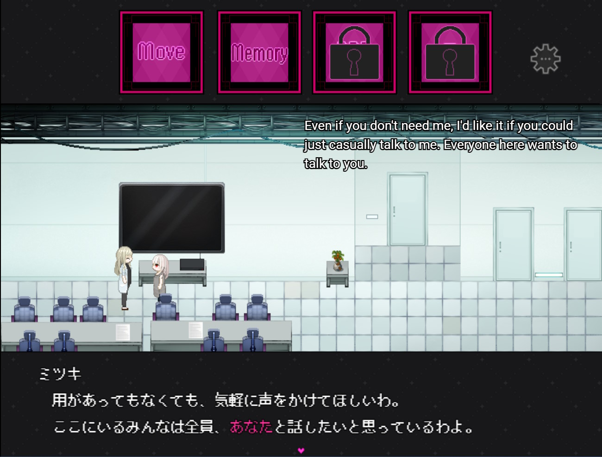

# Mango 4

Mango 4 is a tool to machine translate Japanese media such as games and manga to English in real-time.

**All these models are installed locally** - no need to worry about rate limits! These models are also amoral... if you know you know.

# Features & Examples

### Translating manga

<table width="10%">
  <thead>
    <tr>
      <th width="50%">Source</th>
      <th width="50%">Translation</th>
    </tr>
  </thead>
  <tbody>
    <tr>
      <td width="50%"></td>
      <td width="50%"></td>
    </tr>
    <tr>
      <td width="50%"></td>
      <td width="50%"></td>
    </tr>
    <tr>
      <td width="50%"></td>
      <td width="50%"></td>
    </tr>
  </tbody>
</table>

### Translating games in real-time

    
    
    
    
    
    

# Installation

1. [Download Mango](https://drive.google.com/file/d/1EZs0Cd5nHGP3lQsl7qGBXatBpqb5EGCJ/view?usp=sharing)
2. Unzip the file. 7zip was used to zip it.
3. Open "mango.exe" - it will take a minute to load.

# Requirements

- Windows 10 (some users report it working with older Windows versions... not 100% sure on this)
- 16 GB disk space
- 16 GB RAM
- Semi-modern CPU
- (Likely) Microsoft Visual C++ Redistributables

A Nvidia GPU should **NOT** be required for CPU usage. A Nvidia GPU is only required if you want even faster translations, in which case:

- 4 to 6 GB VRAM (for base models)
- 12 GB VRAM (for strong translation model OR editing model)
- 16 GB VRAM (for strong translation model AND editing model)

# Guides

[Using Mango 4 to translate images or manga pages](guides/mtl_images.md)

[Using Mango 4 without Textractor to translate games](guides/mtl_games_ocr.md)

[Using Mango 4 with Textractor to translate games](guides/mtl_games.md)

[How to enable CUDA for faster translations](guides/cuda.md)

[Adding custom translator models](guides/loading_custom_translator_llms.md)

# Model packs

Mango 4 comes preinstalled with the necessary models. There are additional model packs here which may enhance the experience (not to be confused with other custom models).

Unzipping a model pack will reveal a `models` folder. Drag this `models` folder to where `mango.exe` is located.

- [Stronger MT model](https://drive.google.com/file/d/15gvST4_UgWgaIBZ_J4cugr23ahQ2Zzom/view?usp=sharing) [Supports Japanese/Korean/Chinese to English and is just generally better albeit slower]
- [Korean + Chinese OCR models](https://drive.google.com/file/d/1Cg1haoMSqEqQRqkbWn8qsZ_rJruKkIvU/view?usp=sharing) [Self-explanatory]
- [Post editing model](https://drive.google.com/file/d/1bClqgpoBPYms8ZCja8UymQrx2kJOqY1G/view?usp=sharing) [Refines translations for even better quality but is slow as [REDACTED]]
- Caching model [Allows translation caching for creating and using shared translation cache files] [COMING SOON]
- 2X Stronger MT model [Supports CJK to English and may be even better albeit EVEN slower] [MAYBE COMING SOON]

# API usage

While Mango 4 is open, you can also translate strings by making a `GET` call to `localhost:5000/translate` with the string to translate being the query parameter `text`. 

For example:

`http://localhost:5000/translate?text=こんにちは` would translate `こんにちは`, returning a string (body) with response code `200`.

Errors return the string `ERROR (search logs for "Task7 Error")` with response code `201`.

The currently active translation model will be used to translate the string, regardless of what language the input string is in. You can change the active model in the options menu.

# Where are the benchmarks?

There's a few issues we need to address first.

**Issue 1:** What metrics do we use? Professional human evaluations are expensive, so that leaves us with automated metrics: BLEU is a lame metric. chrF++ is a bit better but still pretty poor. That leaves us with deep metrics like COMET, BERTScore, etc... (COMET seems good enough).

Unfortunately from personal experiments, COMET (and other deep metrics) wasn't highly sensitive to minor pronoun changes - like changing "He said I should go eat broccoli in peace." to "She said I should go eat broccoli in peace." - This is unfortunate since (in my opinion) zero pronoun resolution is one of the biggest issues in MTLing CJK to English. COMET also has issues with extremely long sentences on occasion. COMET also doesn't seem to be super sensitive to typos in named entities which is a bummer (this translation model needs work regarding named entity translation). All that said, COMET is still way better than BLEU.

**Issue 2:** Fairness. What are we really gauging with these benchmarks? Whether one model is better than the other? But can we really say that model A is better than model B - even if it scores higher on a benchmark? How do we know that model A wasn't trained on data in the benchmark? Large MT models tend to be extremely effective at domain adaptation after all. It's also extremely easy to "beat" a benchmark when it comes to unconstrained MT - just train on more data (or make the model bigger)! More data and more scale is king.

**Issue 3:** I love data. I love seeing my models adapt to another domain. I love seeing model loss curves go down by 0.0004 and consistently stay at a lower level. If there was a benchmark containing "test data" unseen by the model, I would love to just take the data and train the model on it further, which would ultimately make the benchmark pointless anyways.

**Issue 4:** Metric bias. These new models are tuned to optimize for COMET scores, and as WMT 24 papers and others find, this makes COMET (the de-facto quality estimation metric) far less accurate to estimate the true translation quality. No - LLMs as a judge are probably not good enough either. Most of the well remarkable ones are tuned on the same data used to tune COMET, so there's still some correlation there. Using plain LLMs runs into the issue of them generating "classes" of scores rather than actually utilizing the full spectrum of continuous values from [0, 100] - for example Gemini tended to generate scores that were exactly "78" or "65" rather frequently. However, there is a recent paper that tried to get around this by using LLMs to generate "silver" translations. Then, embedding models are used to compare the cosine similarity between these translations, providing a new "metric" score - this could be of interest in the future.

**Issue 4.5:** Why I don't use QE metrics instead. There are papers finding that these metrics bizarrely work just as well as actual quality metrics (that have a gold translation to compare to) when it comes to reinforcement tuning a model. I found similar results but with one reaaaaallly bad downside: Reward hacking. If the metric has a length bias *cough* MetricX *cough* then the translation model *will* learn it. If the metric overrewards certain pointless / hallucinated phrases like "Oh my" or "Ah," or "Wow, ", then the model *will* learn it. All these QE metrics have hallucinated phrases that they overreward. They are disastrous for reinforcement tuning. I found Comet23Kiwi XL (QE) to suffer the least from this, but Comet 22 (not QE) was even better so who cares.

# Wait, where did you get the data to train these models?

:innocent:

# Special thanks

Gemma - Gemma models are pretty good. It's just a shame they're so difficult to train with - almost all libraries utilizing them need manual patches to actually train the models right.

MangaOCR - They have an awesome script to synthesize data.

COMET - Their training scripts were used to help train one of the reranking models. Also used their models for reinforcement tuning.

OPUS - While the OPUS dataset was not used to train these models, it was used for experimentation. Some of the logic they used to clean their data was also reused here.

ONNX - A siren's call. A decent inference engine and good for the OCR models. But it's also responsible for 4 GB of bloatware in the form of Pytorch due to IO bindings...

llama_cpp - Very nice inference engine. Unlike vLLM it actually works mostly out of the box on Windows.

ik_llama - Also a very nice inference engine. Sometimes even better - unfortunately run time repacking tends to inexplicably make some model runs go boom?

Ultralytics - Their pretrained YOLO models are nice... but if you want to actually get serious about training YOLO maybe consider YOLOv5 libraries. Ultralytics seems better for quicker deployment instead.

OpenMantra Dataset - Used for showing some examples.

Too many MT research papers / projects to name (Adafactor, DocRepair, knn-MT, BERTFill, 2+2-Concat, B2T, Quality-aware decoding, P-transformer, RoPE, etc...) - Almost all of these tricks ended up failing horrifically but they were a great learning experience nonetheless. (For example: Never use relative positional embeddings alone on tiny MT models for "hard" language pairs)

Mango 1/2 is deprecated - bigger models and bigger systems are the way to go. We don't talk about 3.

[Some observations and discoveries in my journey](guides/quibbles.md)