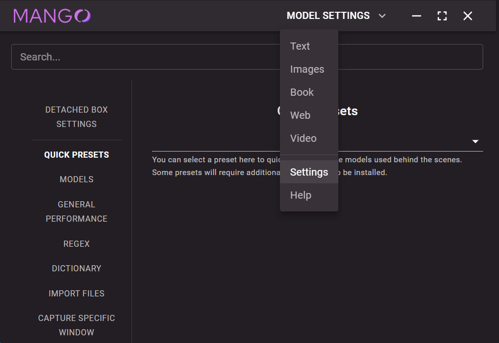
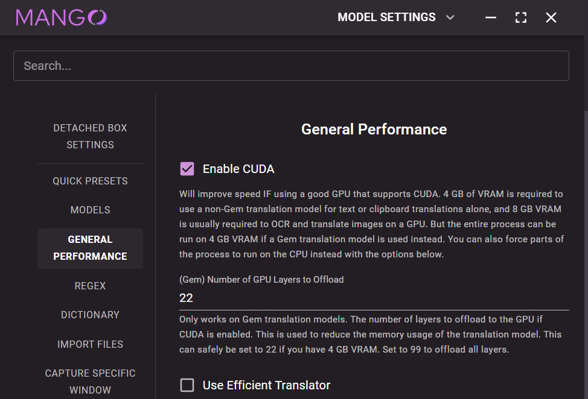
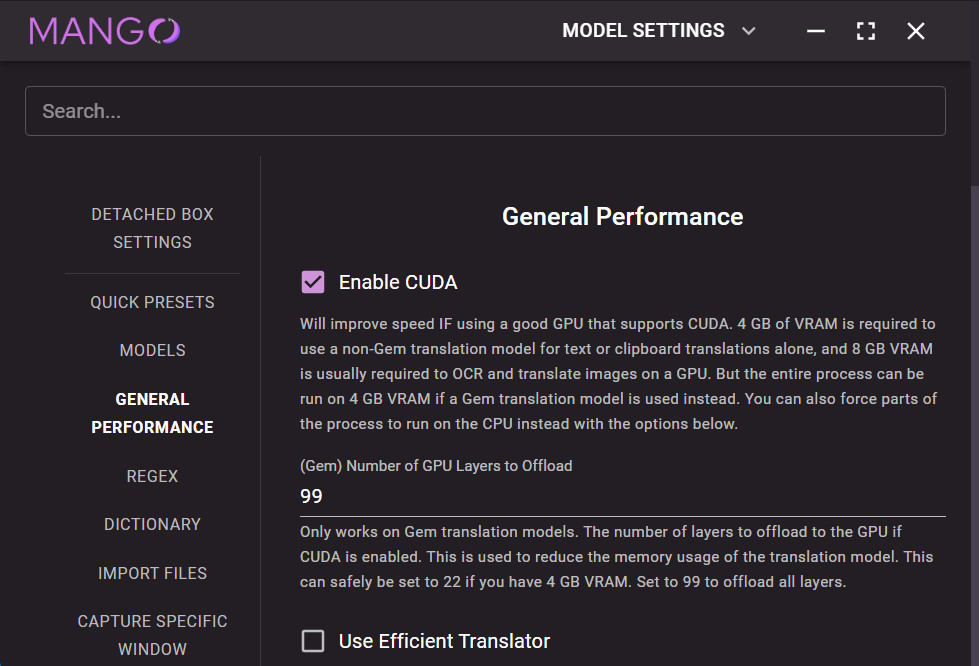

# Enabling CUDA for faster translations.

## Navigate to the Settings tab.

    

## Tick the "Enable CUDA" checkbox.

    

## (Optional) Increase the "Number of GPU Layers to Offload" to 99.

This will increase the VRAM required but make things even faster.

    

## Close and reopen the app.

This step may not be necessary, but it's best to play things safe.

And that's it!