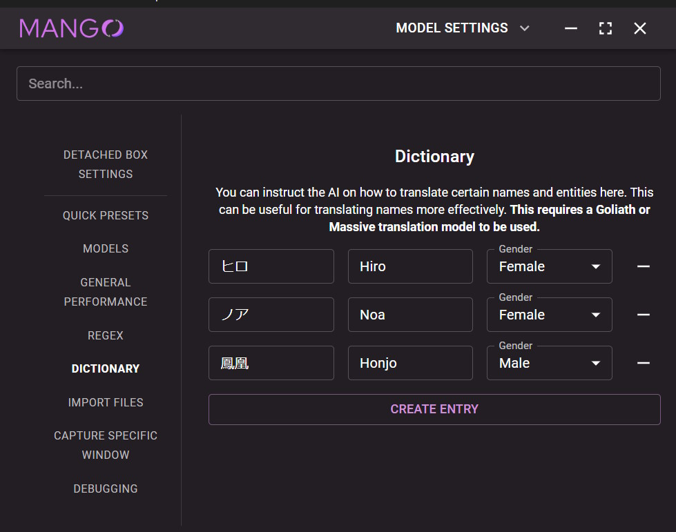
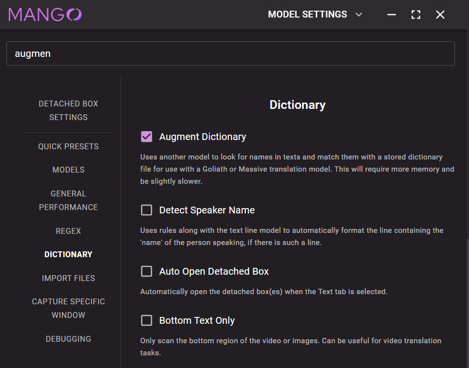

# Using our own dictionary to augment a translator with name knowledge.

**This requires a Goliath or custom translator model to be used.**

It's well known that translation models suffer when it comes to translating names. We can "patch" that up by using our own dictionary dataset, teaching the model on how certain names should be translated. 

Mango supports two approaches for dictionary augmentation:

## 1. Consistent dictionary augmentation

Under this approach, whatever dictionary information we want to feed in will **always** be sent to the model for every translation request. This is the safest approach. But since we will likely be making many translation requests, we probably want to keep this dictionary short.

To add our dictionary information, we would go to the Settings tab in Mango, and head to the Dictionary category....

<p float="left">
    
</p>

Then, we would just type in the source names and their corresponding translations. We can also select a "Gender" for each term.

## 2. Conditional dictionary augmentation

Under this approach, whatever dictionary information we want to feed in will **vary** for every translation request.

Each source text will be scanned for names (using an NER model - not mine). For every name found, Mango will check to see if it exists in our dictionary file and add the corresponding translation if so.

If the name does not exist in the dictionary, that missing name will be recorded in a missing dictionary file - we can then manually modify this missing dictionary and merge it back to the main dictionary file later on.

This approach even works well with massive dictionaries!

To use this approach, we would first make a dictionary file in the models folder under `models/ner/dictionary.json`

Here's an example of what the dictionary should look like:

```
{
    "琉心": [
        {
            "name": "Ryuushin",
            "gender": ""
        },
        {
            "name": "Ryushin",
            "gender": ""
        }
    ],
    "優惟": [
        {
            "name": "Yuui",
            "gender": ""
        },
        {
            "name": "Yūi",
            "gender": ""
        },
        {
            "name": "Yuui",
            "gender": ""
        },
        {
            "name": "Yūi",
            "gender": ""
        },
        {
            "name": "Yui",
            "gender": "Female"
        }
    ]
}
```

Each key corresponds to the source term - and the values corresponds to a list of possible translations (though for most purposes we only want one translation in the list).

Once that's done, open Mango. Then, go to the Settings tab and enable "Augment Dictionary".

<p float="left">
    
</p>

## Combining the two approaches

Both approaches can be used together! 

We can have a consistent dictionary that should always be used (such as for names that Mango can not auto detect in the source text), and then that dictionary would be augmented conditionally when other names are detected.