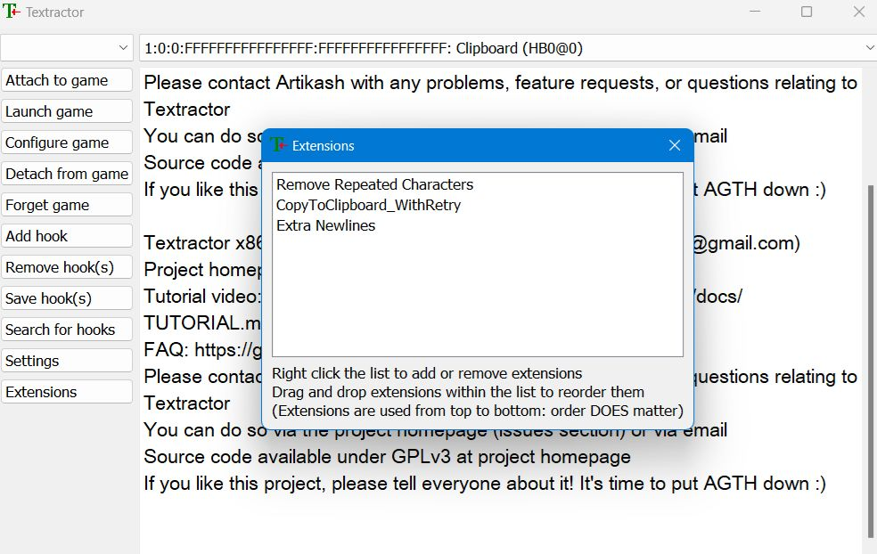
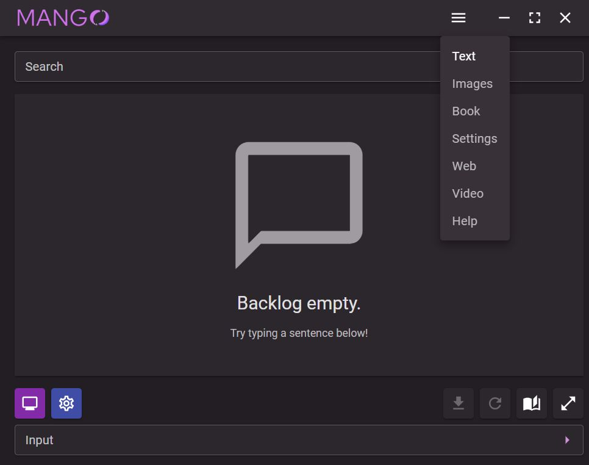
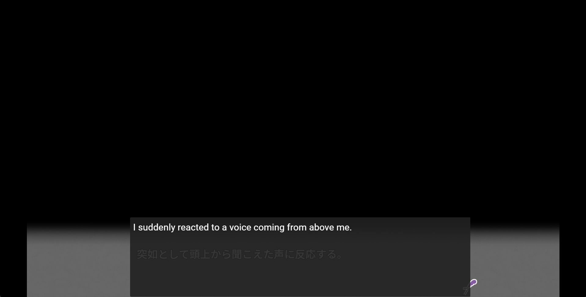

# Using Mango with Textractor to MTL games on the go

I assume Textractor is already installed, and you already have the extension to copy hooked text to the clipboard. See here for details: https://github.com/Artikash/Textractor/issues/762

## Load the game

    

## Load up Textractor

    

Make sure to hook into the game and find the right hook.

## Open Mango and navigate to the Text tab.

    

## Click the purple button on the bottom left in Mango.

    

## Profit!

    

As soon as the purple button with a computer icon is clicked, a text box will appear on the screen. This text box will automagically translate **all** text in the clipboard (from Textractor). 

The first text to translate will take longer than the rest as the models have to load into memory.

You can also change the appearance of the text box by clicking on the blue button with a gear icon in Mango.