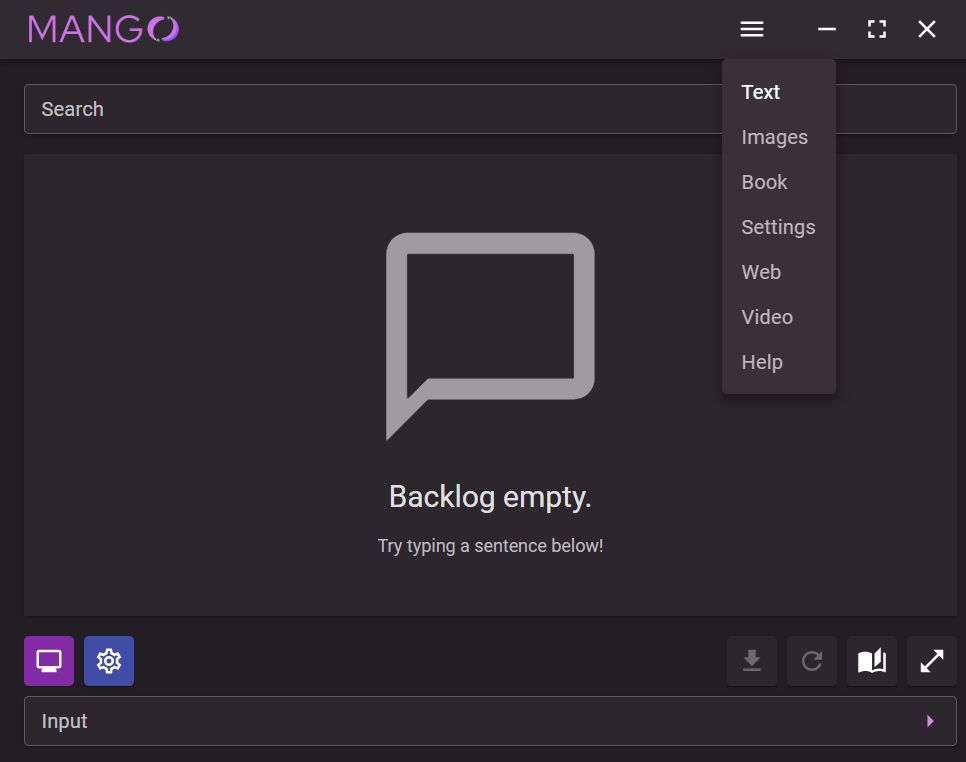
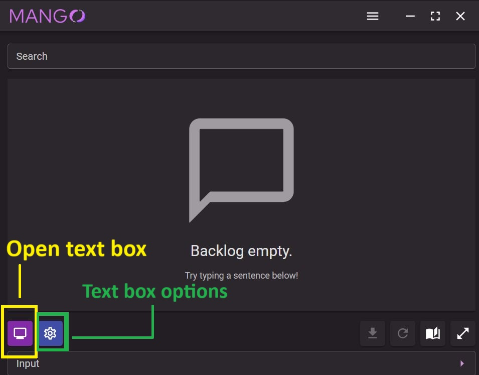

# Using Mango without Textractor to MTL games on the go

## Open Mango and navigate to the Text tab.

    

## Click the purple button on the bottom left in Mango.

    

## Move the boxes around and profit!

    

You'll see a white box near the bottom of the screen. Drag the bottom right edge to move it around where the text will be. Drag the edges to resize it.

Also notice there is a second box with a near-transparent background - this box is where the translated text will show. Drag this anywhere you want except for where the white box is (as you don't want the translated text to be scanned!)

Once the boxes are in position, just press "1" to translate! 

You can also press "h" to make the white box invisible - it can still translate without any issues!

The first text to translate will take longer than the rest as the models have to load into memory.

You can also change the appearance of the text box by clicking on the blue button with a gear icon in Mango.