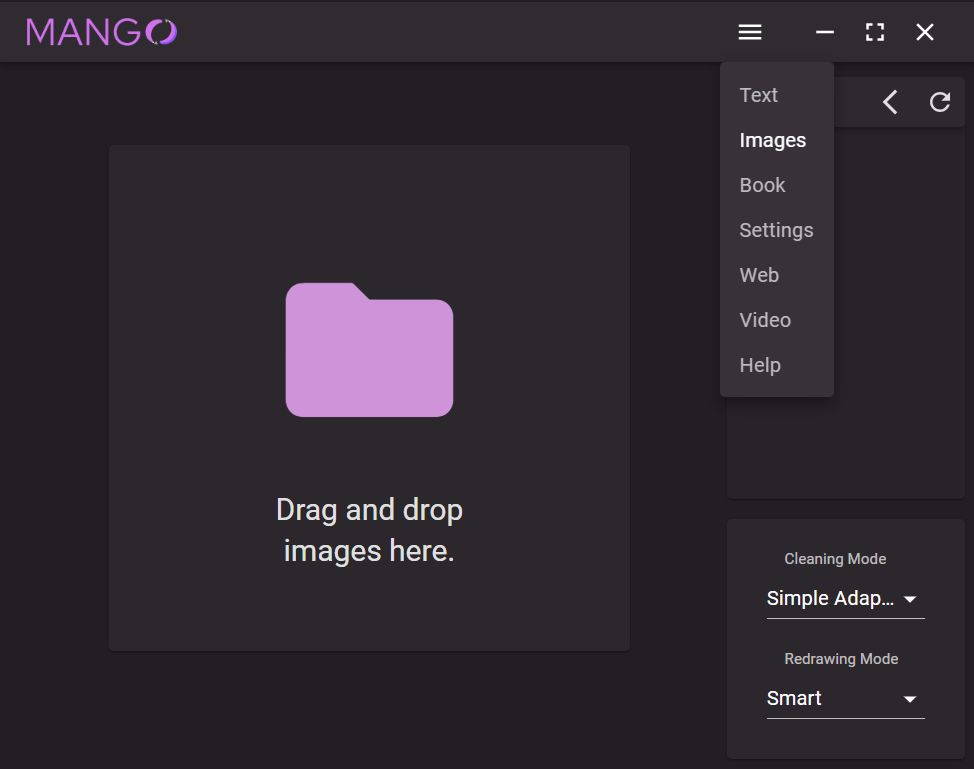
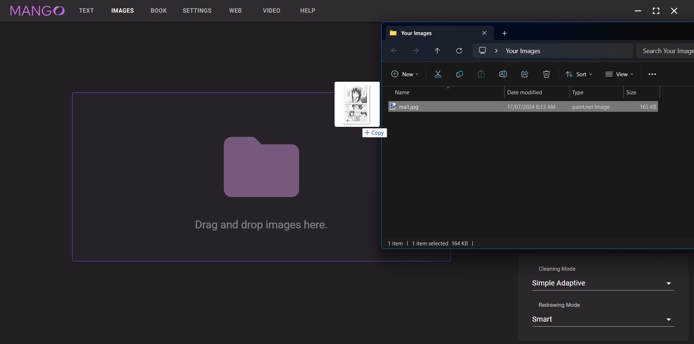
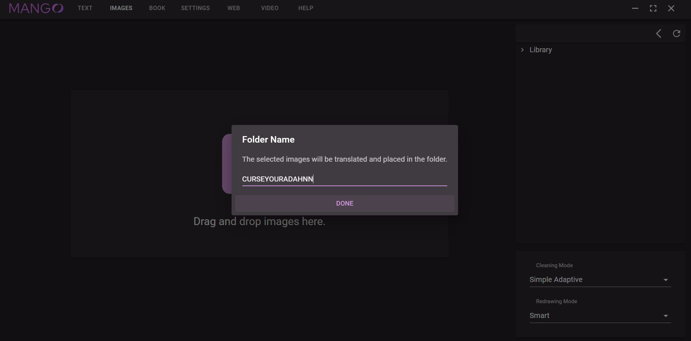
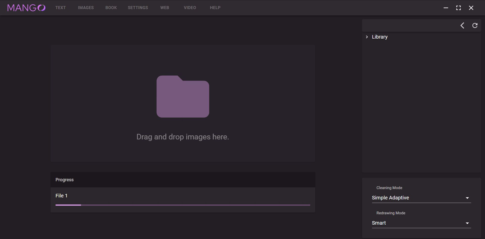
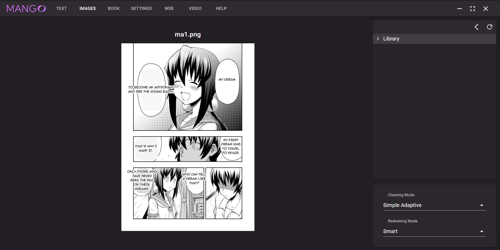

# Using Mango to translate images or manga pages

## Navigate to the Images tab.

    

## Drag and drop an image into the image box.

    

## Give your output folder a name.

    

## ??? (Wait a minute...)

    

The first image will likely take longer to translate than the rest as the models have to be loaded into memory.

Mango runs all models on the CPU by default. You can enable GPU CUDA usage in the settings tab.

## Profit!

    

The images will show on Mango directly. You can also use the library view on the right to navigate through these images, or right click an image in the library to open it in the file explorer.